# DNA compressor benchmark

This benchmark evaluates the performance of general compression tools on a large collection of bacterial genomes ([AllTheBacteria](https://allthebacteria.org/) project data). This repository contains scripts to run the benchmark and analyze the data, alongside my own results and conclusions.

## Compressors descriptions

| Name | Popularity | Code Access | Algorithms Used | Multithreading Support |
| --- | --- | --- | --- | --- |
| **7-Zip** | Very Popular | Open-source | LZMA, LZMA2 | Yes |
| **gzip** | Very Popular | Open-source | DEFLATE (LZ77 + Huffman) | No |
| **Zstandard (zstd)** | Very Popular | Open-source | Zstd (LZ77 + FSE / Huffman) | Yes |
| **pigz** | Popular | Open-source | DEFLATE Parallelized | Yes |
| **bzip3** | Niche | Open-source | Burrows-Wheeler Transform (BWT) | Yes |
| **Block Sorting Compressor (bsc)** | Niche | Open-source | BWT, LZP, Context-Mixing | Yes |
| **mcm** | Experimental | Open-source | Advanced Context-Mixing | No |
| **Fast PPMII (PPMd)** | Experimental | Open-source `*` | PPM (Prediction by Partial Matching) | No |
| **Monstrous PPMII (PPMonstr)** | Experimental | Open-source `*` | PPM (Prediction by Partial Matching) | No |
| **Zero-Cost Modeler (ZCM)** | Experimental | Closed-source | --- | Yes |

`*` I could not build **Fast PPMII** and **Monstrous PPMII** from source due to compilation errors using their provided repository [compression.ru/ds](https://www.compression.ru/ds/). For these compressors I used release `.exe`.

## Notes on experimental compressors

### mcm

#### Decompression path limitation 

Specifying custom output path and filename during decompression fails.

For example:

```bash
Compress: mcm.exe enwik8 enwik8.mcm
Decompress: mcm.exe d enwik8.mcm enwik8.ref
```

does not create file `enwik8.ref`, but it overwrites original uncompressed file. Even though program help says: `Usage: mcm.exe [commands] [options] <infile|dir> <outfile>(default infile.mcm)` and presents the same example. The decompressed file always lands in the same relative path and under the same name as the originally packed file.

#### Side effects

mcm always generates a temporary mapping file named `of.txt` in the working directory during both compression and decompression.

There is no built-in option to disable it or delete this file after mcm has finished running.

---

### Fast PPMII / Monstrous PPMII

#### Path limitations 

Custom output names and paths are not supported during decompression.

Absolute/relative paths cannot be used to reference target input files if they reside outside the current working directory. Running commands like `PPMd.exe e -foutput\compressed .\input\original` will throw a `Can't open file` error.

To benchmark these tools, the script must explicitly change the working directory (`cd`) to the folder containing the target data files before execution. All operations must occur within that directory.

---

### ZCM Archiver

#### Path limitations 

Decompression paths do not behave as expected. While passing a target directory argument like `zcm.exe x .\output\compressed.zcm .\input\` works, ZCM appends the relative directory structure stored during compression. This results in unintended nested outputs (e.g., `.\input\input\original`).

## Experiments description

### Experiment 1 (exp1)

- Tests all compressors against a baseline DNA file (`achromobacter_xylosoxidans__01.seq`, 1.8 Gi) while sweeping through compression levels.
- The goal is to compare compressors and discover good parameters for each compressor using a weighted cost function evaluating execution time and compressed size matching real-world cloud storage/compute costs.

### Experiment 2 (exp2)

- Evaluates selected compressors using the optimized configurations discovered in `exp1` across multiple bacterial species data with varying file sizes.
- The goal is to observe how total dataset size impacts the compression ratio for different bacterial genome and determine the compression characteristics of specific bacterial genomes.

## Replicate results

1. Run `setup.sh` to automatically download and format the bacterial genome datasets from [AllTheBacteria FTP](https://ftp.ebi.ac.uk/pub/databases/AllTheBacteria/Releases/0.2/assembly/).
2. Ensure compressors are installed and available in PATH, or place the required execution binaries inside the `bin/` directory. Experiment scripts dynamically append the `bin/` folder to the environment path variable before launching tests.
3. Execute scripts:
  - Linux: run `exp1.sh` and `exp2.sh`
  - Windows: run `exp1.ps1` and `exp2.ps1`
4. CSV files will be saved in `results/`.
5. Run `analysis/exp1.ipynb` and `analysis/exp2.ipynb` notebooks to generate performance reports.

## Benchmark

Full raw result CSV files and Jupiter Notebook analysis are located in the `results/` and `analysis/` directories.

### Test stand environment

#### Hardware

- **CPU:** Intel Core i7-14700KF (20 Cores, 28 Threads, 5.6 max GHz)
- **RAM:** 63.84 GiB DDR5
- **Storage:** NVMe SSD
- Dual boot configuration (both systems are bare metal)

#### Linux environment

- **OS:** Arch Linux rolling 27 Jun 2026 7.0.14-arch1-1
- **Compressors versions:** 
  | Compressor | Version | Installation Method / Source |
  | --- | --- | --- |
  | **7-Zip** | 26.02 | `pacman` |
  | **gzip** | 1.14-modified | `pacman` |
  | **Zstandard** | v1.5.7 | `pacman` |
  | **bzip3** | 1.5.3 | `pacman` |
  | **pigz** | 2.8 | `pacman` |
  | **bsc** | 3.3.12 | Compiled from source ([libbsc](https://github.com/IlyaGrebnov/libbsc)) |
  | **mcm** | 0.84 | Compiled from source ([mcm](https://github.com/mathieuchartier/mcm/tree/145386f5d39b8317dd183419da3b1f6a863a41dc)) w/ custom fixes |


#### Windows environment

- **OS:** Microsoft Windows 11 Pro 10.0.26200 Build 26200
- **Compressors versions:** 
  | Compressor | Version | Installation Method / Source |
  | --- | --- | --- |
  | **7-Zip** | 26.02 | `Winget` |
  | **gzip** | 1.14 | `MSYS2` (`pacman`) |
  | **Zstandard** | v1.5.7 | `MSYS2` (`pacman`) |
  | **bzip3** | 1.5.3 | `MSYS2` (`pacman`) |
  | **pigz** | 2.8 | Compiled from source (MSYS2 UCRT64 toolchain) ([pigz](https://github.com/madler/pigz)) |
  | **bsc** | 3.3.12 | Compiled from source (Visual Studio LLVM Clang) ([libbsc](https://github.com/IlyaGrebnov/libbsc)) |
  | **mcm** | 0.84 | Compiled from source (MSYS2 UCRT64 toolchain) ([mcm](https://github.com/mathieuchartier/mcm/tree/145386f5d39b8317dd183419da3b1f6a863a41dc)) w/ custom fixes |
  | **ZCM** | 0.93 | Binary Release ([heartofcomp](https://heartofcomp.altervista.org/Archivers.htm)) |
  | **PPMd** (var. I) | Apr 13 2010 | Binary Release ([compression.ru](https://www.compression.ru/ds/)) |
  | **PPMonstr** | Apr 13 2010 | Binary Release ([compression.ru](https://www.compression.ru/ds/)) |

---

### Notes on intermittent failures

Some runs occasionally failed to losslessly reconstruct the original file, or produced no valid archive at all. Two distinct patterns showed up:

- **Deterministic** - certain configs simply never work. E.g. `mcm` with the max-compression flag `-x` reliably produces a 0-byte archive every time
- **Transient** - a run occasionally produced `compressed_size = 0` (e.g. `mycobacterium_tuberculosis__01.seq` with `bzip3 -b256`: `0` bytes, ~0.01-0.03s decompression), or a plausible-looking archive that decompressed to content not matching the original hash - but retrying the exact same (file, config) job would usually succeed. For example, `listeria_monocytogenes__01_1_4.seq` with `7zip -mx=5` produced archives of `63122914` bytes (failed) and `63122834` bytes (succeeded, on retry) for what should be an identical input and config - an 80-byte difference between two "identical" runs. Affected: `bzip3`, `bsc`, `7zip`, `zcm`. Interestingly, `zstd` never failed once, on either OS.

Possible explanations for the transient failures:

- Marginal instability in the overclocked i7-14700K under long, sustained, all-core load.
- Rare concurrency bugs in these tools multithreading code.
- General system-level resource contention (I/O, memory) from an unattended, multi-hour run.

None of this is confirmed - the cleanest way to test the hardware hypothesis would be repeating the same jobs at stock (non-overclocked) clocks.

---

### Experiment 1

Configurations failing to losslessly reconstruct the original file were omitted.

#### Compression ratio vs. compression time

The following charts present the compression ratio versus compression time across different optimization levels for each tested tool.

| | |
|:---:|:---:|
| 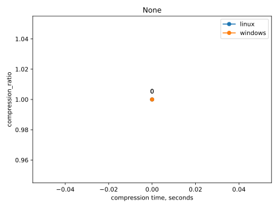 | 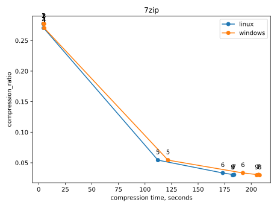 |
| 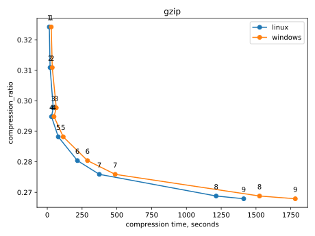 | 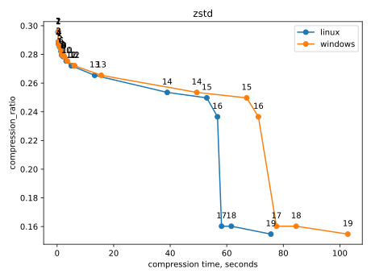 |
| 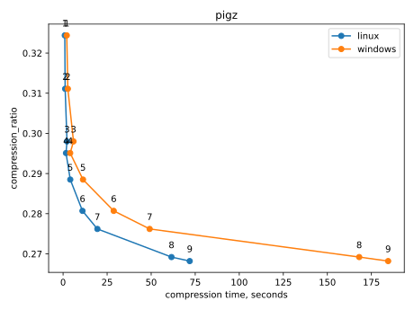 | 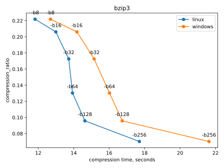 |
| 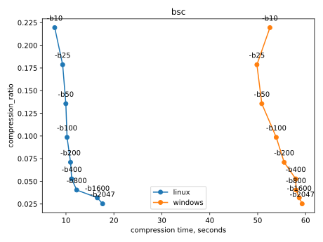 | 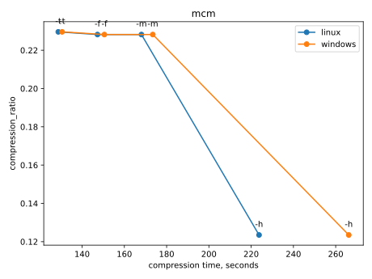 |
| 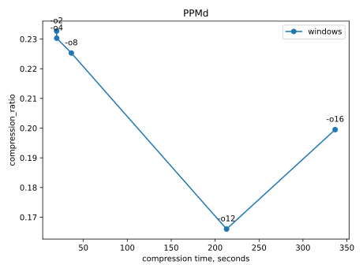 | 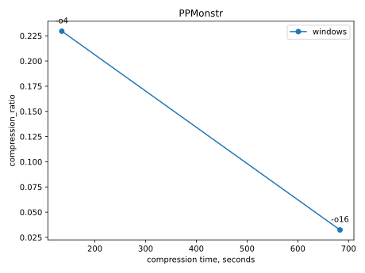 |
| 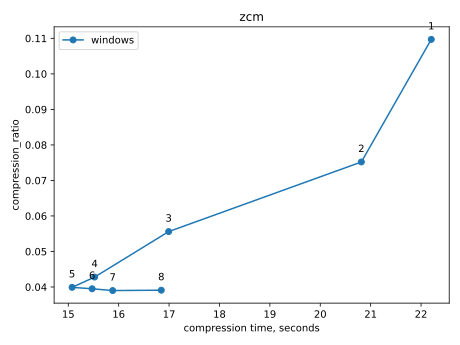 | |

#### Best compressors ranking

The financial costs were estimated using following assumptions:

- **Compute Cost/TB:** Machine used in this benchmark is similar to AWS EC2 `c6g.8xlarge` with costs $1.088/hour ([see Amazon EC2 On-Demand Pricing](https://aws.amazon.com/ec2/pricing/on-demand/)).
- **Storage Cost/TB:** The AWS S3 One Zone-Infrequent Access rate is $0.01/GB/month. Assuming we keep the data stored for 2 years (24 months), the effective rate becomes $0.24/GB (see [Amazon S3](https://aws.amazon.com/s3/pricing/))

| Compressor | OS | Level | Total cost/TB | Compute cost/TB | Storage cost/TB | CPU usage compression [%] | CPU usage decompression [%] |
| --- | --- | --- | --- | --- | --- | --- | --- |
| **bsc** | linux | -b2047 | 9.29 | 3.09 | 6.20 | 17.50 | 45.32 |
| **zcm** | windows | 7 | 12.37 | 2.78 | 9.60 | 85.23 | 86.42 |
| **bsc** | windows | -b2047 | 16.57 | 10.37 | 6.20 | 0.35 | 0.58 |
| **bzip3** | linux | -b256 | 20.35 | 3.10 | 17.25 | 24.65 | 24.08 |
| **bzip3** | windows | -b256 | 21.04 | 3.78 | 17.25 | 22.41 | 31.56 |
| **7zip** | linux | 5 | 32.97 | 19.62 | 13.36 | 49.18 | 12.44 |
| **7zip** | windows | 5 | 34.64 | 21.28 | 13.36 | 84.45 | 29.00 |
| **zstd** | linux | 17 | 49.55 | 10.17 | 39.38 | 86.05 | 4.15 |
| **zstd** | windows | 17 | 52.95 | 13.57 | 39.38 | 93.35 | 2.00 |
| **PPMd** | windows | -o4 | 60.02 | 3.43 | 56.59 | 0.38 | 1.11 |
| **mcm** | linux | -h | 69.47 | 39.13 | 30.35 | 3.64 | 3.71 |
| **pigz** | linux | 6 | 70.91 | 1.93 | 68.99 | 95.40 | 4.68 |
| **pigz** | windows | 5 | 72.88 | 1.98 | 70.91 | 63.44 | 2.50 |
| **mcm** | windows | -h | 76.90 | 46.55 | 30.35 | 4.29 | 1.92 |
| **gzip** | linux | 4 | 77.74 | 5.29 | 72.45 | 3.57 | 3.43 |
| **PPMonstr** | windows | -o4 | 80.00 | 23.58 | 56.42 | 2.15 | 0.67 |
| **gzip** | windows | 4 | 80.91 | 8.46 | 72.45 | 5.46 | 13.88 |
| **None** | --- | 0 | 245.76 | 0.00 | 245.76 | 0.00 | 0.00 |

#### Exp1 conclusions

- Linux consistently outperformed Windows in execution time across all tools.
- Linux and Windows maintain identical compression ratios for matching configurations.
- `bsc` is superior compressor in this benchmark. 
- `bsc` compute time was faster on Linux due to successful utilization of `OMP_NUM_THREADS` and CUDA acceleration—features that were not replicated on the Windows toolchain. This is a common open-source pattern of better compilation support on Linux.
- Tools lacking multithreading support performed poorly in the overall ranking. The chosen metric penalized longer execution times even with low CPU usage (though CPU utilization data is available for alternative analyses).
- The top-performing setups advancing to `exp2` are:
  - `bsc e -b2047`
  - `zcm a -m7`
  - `bzip3 -e -b256`
  - `7zip a -mx=5`
  - `zstd -17`

### Experiment 2

Configurations failing to losslessly reconstruct the original file were omitted.

#### Compression ratio vs. file size

| | |
|:---:|:---:|
|  | 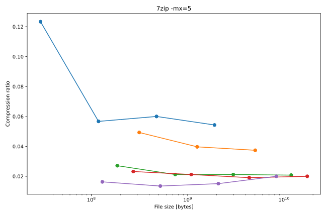 |
| 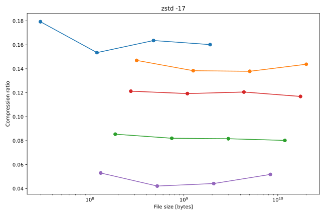 | 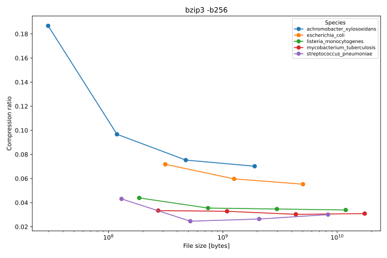 |
| 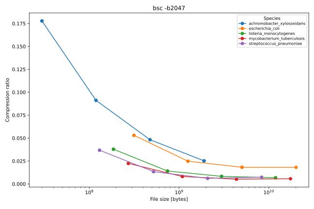 | 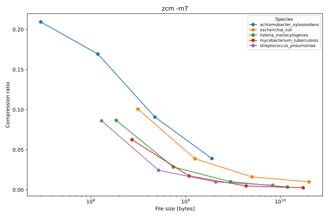 |

#### Compression time vs. file size

| | |
|:---:|:---:|
|  | 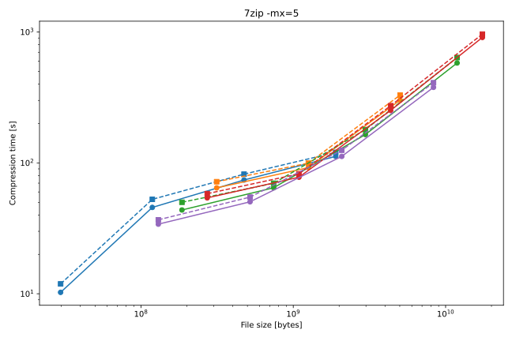 |
| 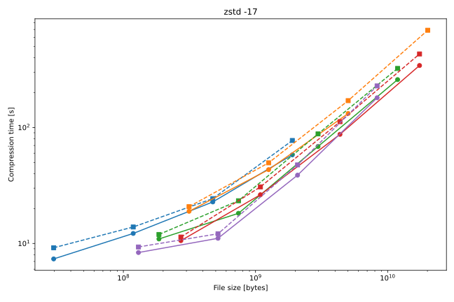 | 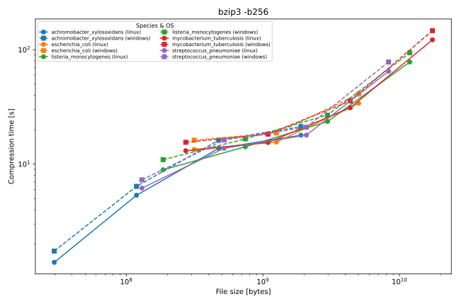 |
| 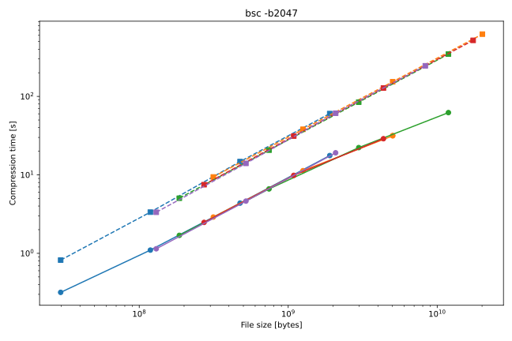 | 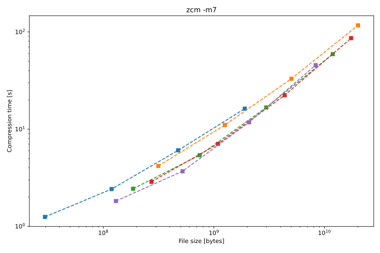 |

#### Exp2 conclusions

- Bigger file size, lower (better) compression ratio, for every compressor tested.
- Compressors running on Linux are generally slightly faster than on Windows, across all species and file sizes.
- Compressibility differs substantially by species.
- **Achromobacter xylosoxidans** is the hardest to compress: highest compression ratio and longest time across all compressors, at matched file sizes.
- **Streptococcus pneumoniae** is the easiest to compress: lowest compression ratio and shortest time across all compressors, at matched file sizes.

## Conclusions

- Of the compressors tested, `bsc -b2047` is the best all-around choice for genome data: best compression ratio in both `exp1` and `exp2`, and the cheapest total cost/TB when run on Linux.
- `bsc` was much faster on Linux thanks to working `OMP_NUM_THREADS` multithreading and CUDA acceleration, neither of which were successfully replicated on the Windows build. It is rather a toolchain issue, not a limitation of the compressor itself.
- `zcm` was a surprise: a little-known, closed-source, experimental tool that placed second in cost ranking
- Larger genomes compress better in relative terms, so batching/concatenating smaller files before compression is preferable to compressing them individually, where feasible.
- Different bacteria have different amounts of repeated data in their DNA, so they compress differently.